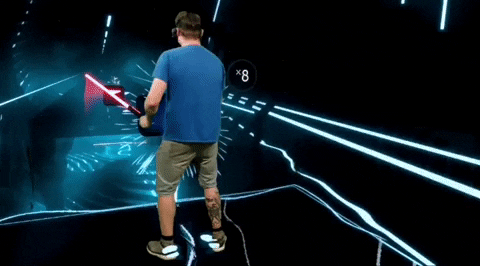
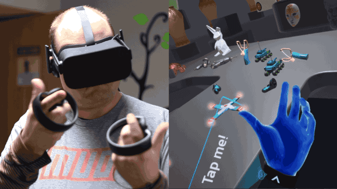
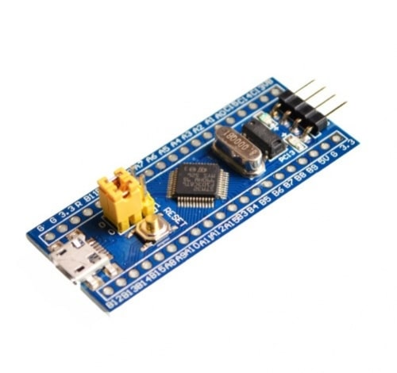

# Final Year Project
# VR headset 

                                          
                                                  
the goal of this project is to create  VR democratization by the means of inexpensive hardware and 
create a vr game using Unreal engine.
the hardware i will be using is an STm32 Microcontroller and a Mpu6050

                                                
## How It Works

VR glasses contain 2 lenses that help to create a 3D virtual image by angling 2 slightly different 2d images. light passes through the cornea, iris and lens up to finally at the retina. from the retina all the information travels to the brain and is processed

## components i will be using
## STM32

## WHY I AM USING AN STM32?
## The Speed! 

as the clock speed gets higher , the amount of time a microcontroller will need for executing a code instruction will decrease ! say a microcontroller capable of a 400Mhz clock speed . this 400Mhz means that the controller can do 400 million clock cycles on one second . any code instruction will need certain amounts of clock cycles to be totally executed . example: say we have that microcontroller with 400Mhz clock speed . 
and say we have a code instruction that needs 100 clock cycles to be executed . 
question: how much time this microcontroller needs to execute this code instruction ? solution: 400Mhz -> 400 million clock cycle per second any clock cycle will then be at : 1/(400 million) = 2.5 nS (nano second) so we have 2.5nS per clock cycle for this microcontroller . so the 100 clock code instructions will need 2.5nS x 100 = [ 250 nS ] to be totally executed by this 400MHz microcontroller . 
let's do all that , for a standard arduino board that usually have a 16Mhz clock speed . any clock cycle will then be at : 1/(16 million) = 62.5 nS (nano second) so we have 62.5nS per clock cycle for this Arduino board . so the 100 clock code instructions will need 62.5nS x 100 = [ 6250 nS ] to be totally executed by this 16MHz Arduino board. Who is the fastest board do you think ? it is the one with higher clock speed ! mathematical equations have lots of code instructions , 
that requires lots of clock cycles . 
and if the microcontroller is not very fast to execute them within the acceptable amount of time , other followed instructions will got delayed ! and so maybe a Small functioning on the work of the entire code . 
in this VR application ,most cases you will have a delay between the movement of the unit and the displayed view on the lcd !

## How will steam vr receive the signals?

## OSVR(OPEN SOURCE VIRTUAL REALITY)

.jpg)

Open Source Virtual Reality is an open-source software project that aims to enable headsets and game controllers from all vendors to be used with any games developed by Razer and Senses. It is also a virtual reality headset that claims to be open-source hardware using the OSVR software
 OSVR is designed to work with several other head-mounted displays and is on a mission to establish an open standard so that existing devices and software can become interoperable.
Developers and consumers with OSVR-compatible HMDs, can already get started by configuring their equipment. The OSVR website features a perfect showcase of their software (also called “experiences”) that are compatible and ready to run. There are already games, media players, emulators and more! There is lots of SteamVR-powered content too.

## In General :
1.      We get the gyroscope+accelerometer data from the MPU6050 sensor through the I²C .
2.      We process these data to get the Quaternions we needs q(w,x,y,z).
3.      We use the Quaternions to get the gravity vectors .
4.      We use the gravity vectors to get the tilt angle.
5.      We use the tilt angle to get the drift due to tilt .and we use the default values for the drift due to yaw.
6.      We do the tilt and yaw corrections based on the drift due to tilt calculated, and default drift due to yaw .
7.      We apply those corrections to the Quaternions q(w,x,y,z).
8.      We send the corrected q(w,x,y,z) to the PC via serial communication for further processing by the VR software.

 

